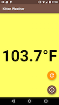
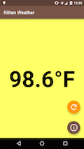
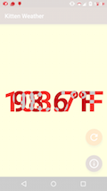

# KittenWeather Android

Demo project for showcasing various testing tools and frameworks for Android apps.
Ported from the iOS version created by [@SeanMcTex](https://github.com/SeanMcTex/KittenWeather).
See that project for details on the techniques used.

## Installation and Running
 * You'll need a recent version of Android Studio that supports local unit tests. I used v1.2.1.1.
 * Import the top level build.gradle file as a new project in Android Studio.
 * Add a new Build Configuration for JUnit:
    - Run -> Edit Configurations...
    - Click '+' -> JUnit
    - Test Kind: "All in Package"
    - Package: "com.chuckbjones.kittenweather"
    - Search for Tests: in single module
 * Run... -> JUnit tests.


## QuickCheck
 *junit-quickcheck* is used as an analog for *Fox* in iOS.

 To install junit-quickcheck, add the following to your build.gradle file:

    dependencies {
            testCompile 'junit:junit:4.12'
            testCompile 'org.hamcrest:hamcrest-library:1.3'
            testCompile 'com.pholser:junit-quickcheck-core:0.4'
            testCompile 'com.pholser:junit-quickcheck-generators:0.4'
    }

 Here is an analogous test to `testIdentityKelvin` in the iOS version. junit-quickcheck defaults to
 a sample size of 100 and a range of 0.0 to 1.0 for floats, so we override those in the parameter annotation:

     @Theory
     public void identityKelvin(@ForAll(sampleSize = 10000) @InRange(min = "-10000", max = "10000") float kelvinTemperatureNumber) {
         Temperature temperature = Temperature.fromKelvin(kelvinTemperatureNumber);
         float difference = Math.abs(kelvinTemperatureNumber - temperature.kelvinDegrees());
         assertThat(difference, is(lessThan(MATCHING_TOLERANCE)));
     }

## Monkey
Android's [UI/Application Exerciser Monkey](http://developer.android.com/tools/help/monkey.html) tool is an analog to UIAutoMonkey for iOS.

Because it generates completely random touch, keypress, and button events, the monkey can cause some havoc on your device. It has even been know to [take occasional screenshots and randomly start playing music on its own](http://www.everybodytests.com/2014/08/why-is-android-monkey-so-naughty.html).

So, it's a good idea to disable system events (eg. pressing the power or volume buttons) and keypress events for other 'special' keys like [Print Screen](http://developer.android.com/reference/android/view/KeyEvent.html#KEYCODE_SYSRQ). This is done by setting the frequency of those events to 0 using monkey's command line options. 

If you are running Lollipop or higher, you can also [pin](https://support.google.com/nexus/answer/6118421?hl=en) the application under test to prevent monkey from escaping from your app and changing your Wi-Fi settings, etc.

### Unleash the Monkey
The monkey lives on your device (or emulator). To set him loose, you will need [adb](http://developer.android.com/tools/help/adb.html) installed and in your path. If using Android Studio, `adb` will most likely be installed under `~/Library/Android/sdk/platform-tools/adb` (OS X).

Connect your device and run monkey via `adb shell` from the terminal:

    adb shell monkey -v -p com.chuckbjones.kittenweather \
        --pct-touch 70 \
        --pct-motion 10 \
        --pct-trackball 6 \
        --pct-nav 6 \
        --pct-majornav 5 \
        --pct-rotation 1 \
        --pct-pinchzoom 1 \
        --pct-flip 1 \
        --pct-anyevent 0 \
        --pct-syskeys 0 \
        --pct-appswitch 0 \
        2000

Here, we are specifying the frequencies of each event type as percentages. If specifying a number for each type, they must add up to 100. If any are omitted, their respective default is used, adjusted in relation to the numbers provided so that they all add up to 100%.

Here are the default frequencies pulled from the [source code](https://android.googlesource.com/platform/development.git/+/master/cmds/monkey/src/com/android/commands/monkey/MonkeySourceRandom.java):

    mFactors[FACTOR_TOUCH] = 15.0f;
    mFactors[FACTOR_MOTION] = 10.0f;
    mFactors[FACTOR_TRACKBALL] = 15.0f;
    mFactors[FACTOR_ROTATION] = 0.0f;
    mFactors[FACTOR_NAV] = 25.0f;
    mFactors[FACTOR_MAJORNAV] = 15.0f;
    mFactors[FACTOR_SYSOPS] = 2.0f;
    mFactors[FACTOR_APPSWITCH] = 2.0f;
    mFactors[FACTOR_FLIP] = 1.0f;
    mFactors[FACTOR_ANYTHING] = 13.0f;
    mFactors[FACTOR_PINCHZOOM] = 2.0f;

Note that there are a number of options that are not listed in the tool's documentation. I haven't begun to explore [all of them](https://android.googlesource.com/platform/development.git/+/master/cmds/monkey/src/com/android/commands/monkey/Monkey.java), but one of note is `--pct-rotation`. This option has a default frequency of 0%, meaning you must specify it if you want the monkey to test orientation changes, a common source of crashiness in Android apps. 

The 2000 at the end of the command is the number of events to trigger. It doesn't have a switch associated with it, so it must appear last in the command.

## MonkeyImage
The MonkeyImage component of Android's [monkeyrunner](http://developer.android.com/tools/help/monkeyrunner_concepts.html) tool is an analog to FBSnapshotTestCase for iOS.

Monkeyrunner is almost, but not quite, entirely unlike ~~tea~~ monkey. It runs on your development machine and controls your device or emulator remotely. Where monkey behaves randomly, monkeyrunner performs the specific commands we give it. We do this by writing a python script and passing it in to monkeyrunner.

We are mainly interested in the [MonkeyImage](http://developer.android.com/tools/help/MonkeyImage.html) component of monkeyrunner. A MonkeyImage represents a screenshot taken from a connected device. The image can also be read from or written to disk, and we can compare two MonkeyImages to determine their similarity.

Here is a snippet of a monkeyrunner script that takes a screenshot from a device and compares it to a reference image stored on disk. If the images don't match, we generate a visual diff using [ImageMagick's compare tool](http://www.imagemagick.org/script/compare.php). The full script can be found in `monkeyimage.py`. It was largely inspired from [this article by Diego Torres Milano](http://dtmilano.blogspot.com/2011/04/monkeyrunner-visual-image-comparison.html).

```python
    print "launching application..."
    device.startActivity(component=RUNCOMPONENT)
    MonkeyRunner.sleep(1)

    print "taking snapshot..."
    screenshot = device.takeSnapshot()
        
    # uncomment the following line to update the reference image
    # screenshot.writeToFile(REF)

    print "retrieving reference snapshot..."
    reference = MonkeyRunner.loadImageFromFile(REF)


    print "comparing snapshots..."
    same = False
    try:
        same = screenshot.sameAs(reference, ACCEPTANCE)
    except:
        print "Unexpected error:", sys.exc_info()[0]

    if not same:
        print "comparison failed, getting visual comparison..."
        screenshot.writeToFile(SCR)
        subprocess.call(["/usr/local/bin/compare", REF, SCR, CMP])
        sys.exit(1)
```
The script first launches the application under test, waits a second for it to settle, then takes a screenshot. The screenshot is returned as a MonkeyImage object. If this is the first time running the script or if the app's user interface has recently changed, we can uncomment the `screenshot.writeToFile()` command to update the reference image with the current version. 

Next, the script reads the reference image in from disk and compared to the current screenshot using `MonkeyImage.sameAs()`. If the images don't match, we pass them to `compare`, which generates a diff image that we can use to examine the differences. 

[](img4readme/screenshot.png "Current Screenshot")
[](img4readme/reference.png "Reference Screenshot")
[](img4readme/comparison.png "Diff Screenshot")

These images show, respectively, the screenshot taken by monkeyrunner, the reference screenshot stored in the repo, and the diff screenshot generated by Image Magick. The pixels that don't match exactly are highlighted in red. We can clearly see that the temperature readings don't match in the two versions. Also note the minor differences in the status bar at the top of the screen.

### Issues

#### Status bar
The status bar will prevent your screenshots from matching 100%. The clock, wifi signal, notifications, etc. are always in flux. There are a few ways we can work around this issue:

* `MonkeyImage.sameAs` takes a parameter that lets you specify the percentage of pixels that are allowed to differ. On a high resolution device you will want to set this number pretty high because the status bar will be a very small percentage of the total screen size. It is stored as a `double`, so you can get as precise as you want, e.g., `0.999`. 
* Crop the tops of the images before comparing. Status bar height will vary on different devices and orientations, so we will have to keep track of the exact height to crop for each device we test with.
* Pin the application before taking the screenshot. Ideally, we would pin the app automatically in the script and unpin it when exiting. I don't know if monkeyrunner supports that. 

I've implemented the first solution in this demo. The others are left as an exercise for the reader.

#### Dynamic content 

The reference image is stored in the repo so that we can rerun the test in the future to ensure that we haven't broken the UI. But how do we handle apps that display dynamic content, i.e., all of them?

KittenWeather displays the current temperature in your current location, along with a random picture of a kitten. The odds that any screenshot you take today will match a reference shot taken months ago are slim. We need a way to provide a consistent UI for our tests. [Dagger](http://square.github.io/dagger) to the rescue!

Dagger is a dependency injector for Android. It allows us to have different behavior in testing as opposed to production by replacing the logic for pulling data from webservices with mocks that returned canned data.

In our `build.gradle` file, we add two [product flavors](https://developer.android.com/tools/building/configuring-gradle.html#workBuildVariants): monkey and production.

```gradle
android {
    
    ...
    
    productFlavors {
        monkey
        production
    }
}
```

In the source code for each flavor (`src/production/...` and `src/monkey/...`) we add a `Modules.java` class that defines how the WeatherService and KittenService dependencies are resolved. In production, we use the default logic that pulls the data from the web. In the monkey flavor, we override that logic to always return `98.6°F` in place of the actual weather, and the color yellow in place of a kitten.

In `monkeyimage.py` we always build and install the monkey variant onto the connected device to ensure that our screenshots will be consistent:

```python
    print "building application..."
    subprocess.call(['./gradlew', 'assembleMonkeyDebug'])

    print "installing application..."
    device.installPackage('app/build/outputs/apk/app-monkey-debug.apk')
```

##### So many combinations

This demo only has one reference image. In a real-world application, you will have many screens and you will want to test them on many different devices in both landscape and portrait orientations. MonkeyImage assumes that images have the same dimensions when comparing them. Trying to test on a Nexus 6 when your reference image was taken on a Nexus 4 will definitely fail.

Instead of saving just a single reference image, you will want to save one for each device/screen/orientation combination that you want to test. These combinations can add up rapidly, so you will want to prioritize the most important ones, and leave the others behind.

## Libraries used in this demo
 * Dagger - http://square.github.io/dagger
 * ButterKnife - http://jakewharton.github.io/butterknife
 * Retrofit - http://square.github.io/retrofit
 * Picasso - http://square.github.io/picasso
 * FloatingActionButton - https://github.com/makovkastar/FloatingActionButton
 * JUnit - http://junit.org/
 * Hamcrest - http://hamcrest.org/
 * junit-quickcheck - https://github.com/pholser/junit-quickcheck
